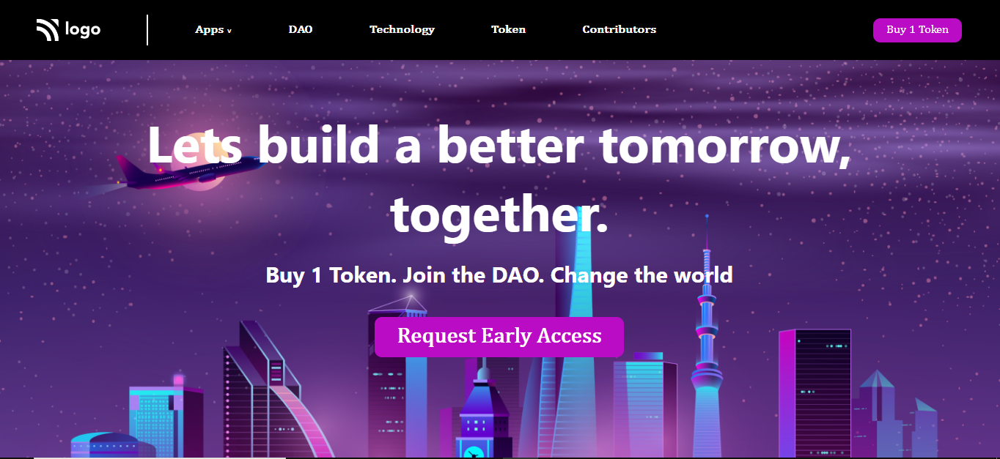
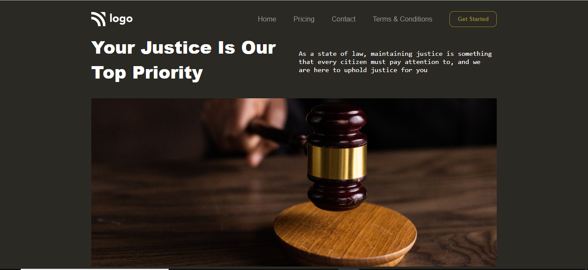

# I have started learning about web development

**And Here I Upload my all projects**

## project 1
_Output Image_

## project 2
_Output Image_

## project 3
_Output Image_

## project 4
_Output Image_

<!-- follow link -->

<!-- link of instagram -->

<!-- youtube -->

